# Deployment with Azure
This repository contains the code and configuration files needed to deploy a web application using Azure services. It also demonstrates how to automate the deployment process using GitHub Actions and Azure DevOps for continuous integration and continuous deployment (CI/CD).

---  

## Table of Contents
- [Prerequisites](#prerequisites)
- [Project Overview](#project-overview)
- [Project Setup](#project-setup)
- [Azure Account Setup](#azure-account-setup)
- [Azure static web app Setup](#azure-static-web-app-setup)
- [Azure App Service Setup](#azure-app-service-setup)
- [Azure DevOps Setup](#azure-devops-setup)
- [Azure DevOps CI/CD Pipeline Setup](#azure-devops-cicd-pipeline-setup)
- [Monitoring the Pipeline](#monitoring-the-pipeline)
- [YAML File Explained](#yaml-file-explained)
- [Troubleshooting](#troubleshooting)
- [Further Resources](#further-resources)
- [Conclusion](#conclusion)

---  

## Prerequisites
Before starting, ensure you have:
- [Azure Account](https://azure.microsoft.com/en-us/free/). The free account provides you with a limited amount of credits to use for Azure services for the first 30 days. After that, you can continue using some services for free, but others will incur charges. 
**Note:** Another option is that you can subscribe for a student account if you are a student. You can get free credits for the first year and some services are free for 12 months. for that you have to verify your student status. you can subscribe [here:]( https://azure.microsoft.com/en-us/free/students/.)
- [Github account](https://github.com/).
- [Git](https://git-scm.com/) installed on your local machine.
- [Node.js and npm](https://nodejs.org/) installed. Node.js is a JavaScript runtime that allows you to run JavaScript code on the server side. npm is the package manager for Node.js that allows you to install and manage packages for your Node.js applications.
-  **IDE:** You will need an IDE to edit the code and configuration files, such as [Visual Studio Code](https://code.visualstudio.com/).
---  
## Project Overview
This project is a basic web application built with React, Node.js (Express), and PostgreSQL. It consists of:
- **Client:** The client-side application built with React. It is a simple web application that allows users to interact with the server-side application. The client-side code is located in the `client` directory.
- **Server:** The server-side application built with Node.js and Express. It is a simple REST API that allows users to interact with the PostgreSQL database. The server-side code is located in the `server` directory. The server uses PostgreSQL as the database to store and retrieve data. The server-side code is located in the `server` directory.
- **PostgreSQL:** The database used to store and retrieve data. You can use any PostgreSQL database, such as [ElephantSQL](https://www.elephantsql.com/) or [Heroku Postgres](https://www.heroku.com/postgres). You can also Setup your own PostgreSQL database on Azure using [Azure Database for PostgreSQL](https://azure.microsoft.com/en-us/services/postgresql/).
The project is structured as follows:
```
DeploymentWithAzure
├── .github
│   └── workflows
├── client
│   ├── public
│   ├── src
│   ├── .gitignore
│   ├── package.json
│   └── README.md
├── server
│   ├── .gitignore
│   ├── .env
│   ├── package-lock.json
│   ├── package.json
│   ├── app.js
│   ├──azure.yml
└── README.md
```
---  

## Project Setup
1. **Clone the repository:** Clone this repository to your local machine using the following command:
```bash
git clone https://github.com/hossei-cyber/DeploymentWithAzure.git
```
2. **Navigate to the project directory:** Change to the project directory using the following command:
```bash
cd DeploymentWithAzure
```
3. **Install dependencies:** Install the required dependencies using npm in both folders Client and Server. Run the following command in the client directory:

```bash
cd client # Navigate to the client directory
npm install # Install dependencies for the client
cd ..  # Navigate back to the project directory
cd server # Navigate to the server directory
npm install  # Install dependencies for the server
```
This should install all the required dependencies for both the client and server applications. You will have node_modules folder in both directories.
4. **Create a .env file:** Create a .env file in the server directory and add the following line to it:
```bash
DATABASE_URL=your_database_url_here
```
Replace `your_database_url_here` with the actual URL of your PostgreSQL database. This URL should include the username, password, host, port, and database name.
**Note:** You can also leave out the DB Connection Part by commenting it out in the app.js file. 

5. **Run the server:** Start the server by running the following command in the server directory:
```bash
cd server # Navigate to the server directory
npm start  # Install dependencies for the server
```
6. **Run the client:** Start the client by running the following command in the client directory:
```bash
cd client # Navigate to the client directory
npm start  # Install dependencies for the client
```

--- 

## Azure Account Setup
1. You can check your Subscription in the Azure Portal. You can find it [here](https://portal.azure.com/#blade/Microsoft_Azure_Billing/SubscriptionsBlade). In my Case  I have an Azure for Students subscription, which looks like this:
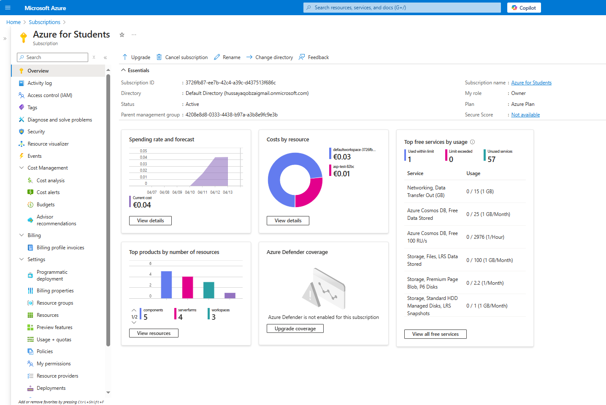
 
If you see this, then you are ready to go. If not, you can create a new subscription by clicking on the "Add" button and following the instructions. You can also check your credits and usage in the Azure Portal [here](https://portal.azure.com/#blade/Microsoft_Azure_Billing/UsageBlade).  For a tutorial on getting introduced to Azure portal, you can watch [this](https://www.youtube.com/watch?v=leJRc0JWzSY) video.

---  

### Azure Static Web App Setup
Follow these steps to deploy your static web app using Azure:

1. **Create a Static Web App**
   - Navigate to the Azure Portal.
   - Click **Create a resource**, search for **Static Web App**, and click **Create**.

2. **Configure Basic Settings**
   - **Subscription:** Choose your Azure subscription.
   - **Resource Group:** Select an existing group or create a new one.
   - **Name:** Provide a unique name for your static web app.
   - **Hosting Plan:** Select the **Free** plan (suitable for most scenarios).

3. **Deployment Configuration**
   - **Deployment Method:** Choose **GitHub Actions**.
   - **GitHub Account:** Select and authorize your GitHub account.

4. **Repository and Branch Setup**
   - **Organization:** Select your GitHub organization.
   - **Repository:** Choose your project repository.
   - **Branch:** Select the branch (typically `main`) to deploy.

5. **Build Configuration**
   - **Build Presets:** Choose **React**.
   - **Build Output:** Set the build output location to `client/build`.

6. **Review and Create**
   - Review all settings, then click **Create**.
   - Azure will provision your static web app.

7. **Verify Deployment**
   - Navigate to the **Static Web Apps** section in Azure Portal.
   - Select your app and check the **Overview** and **Deployment Center** for deployment status.
   - Open your app URL to confirm it's running.

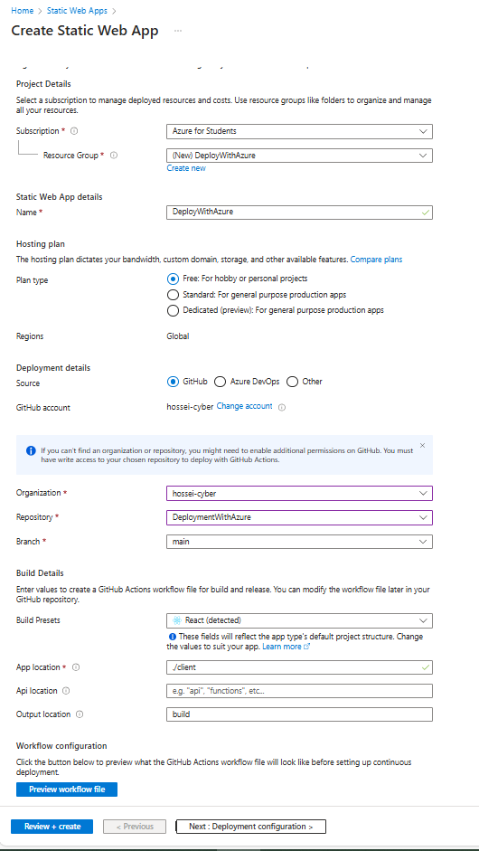
---
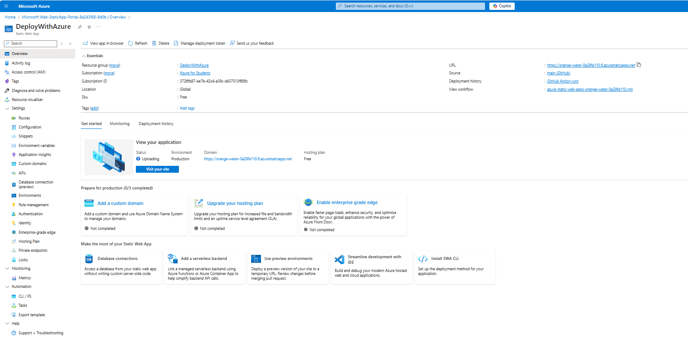
---
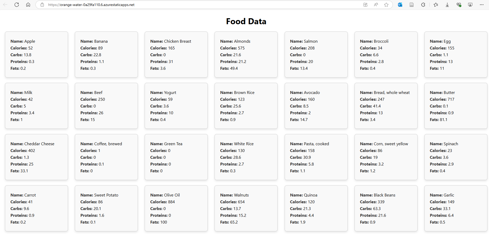

---  

## Azure App Service Setup
Follow these steps to deploy your web application backend using Azure App Service:

### 1. Create a Web App in Azure

- Log in to the [Azure Portal](https://portal.azure.com/).
- Click **Create a resource** and search for **Web App**, then click **Create**.

### 2. Configure Basic Settings

- **Subscription:** Choose your Azure subscription.
- **Resource Group:** Select an existing one or create a new group.
- **Name:** Enter a unique name for your web app.
- **Publish:** Select **Code**.
- **Runtime Stack:** Select **Node.js** (choose appropriate version).
- **Operating System:** Choose **Linux**.
- **Region:** Select the region closest to your users.

### 3. Configure App Service Plan

- **App Service Plan:** Create a new or select an existing plan.
- **Pricing Tier:** Select **Free** (recommended for initial setup).

> **Note:**  
> An App Service Plan determines hosting resources (region, instance size, pricing). You can host multiple apps within a single plan to optimize costs.  
> **Important:** App Service Plans are billed based on chosen tiers. Delete unused plans via **App Service Plans** to avoid unnecessary charges.

### 4. Additional Deployment Settings (Optional)

- **Basic Authentication:**  
  You may enable basic authentication during setup or later in the **Authentication** settings of your app.

- **Continuous Deployment:**  
  Optional for our use-case as Azure DevOps pipelines handle CI/CD. Can be enabled later through the **Deployment Center** in Azure Portal if required.

### 5. Review and Deploy

- Review all settings carefully.
- Click **Create** to deploy your web app. Azure will provision the resources, which may take a few minutes.

### 6. Verify Your Deployment

- Go to **App Services** in Azure Portal.
- Click your new web app to view the overview and deployment logs under **Deployment Center**.
- Confirm your app is live by accessing the provided URL.

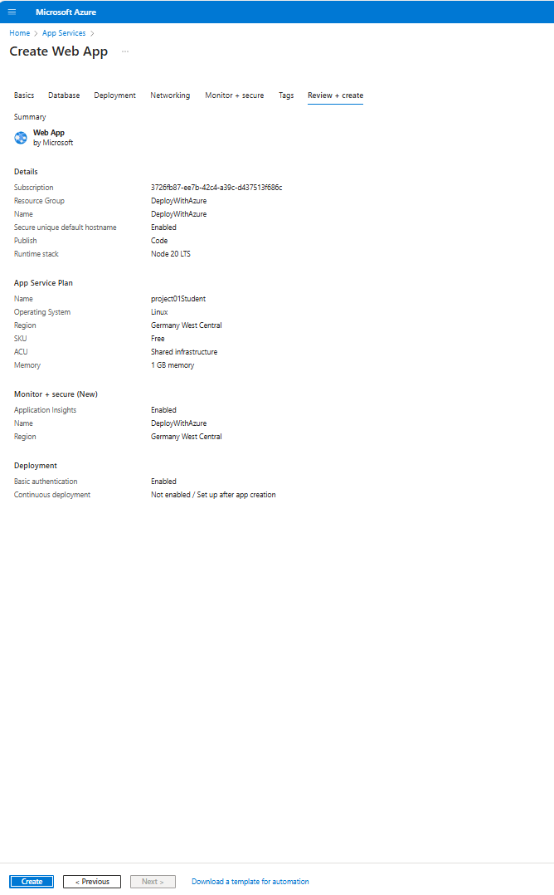
---
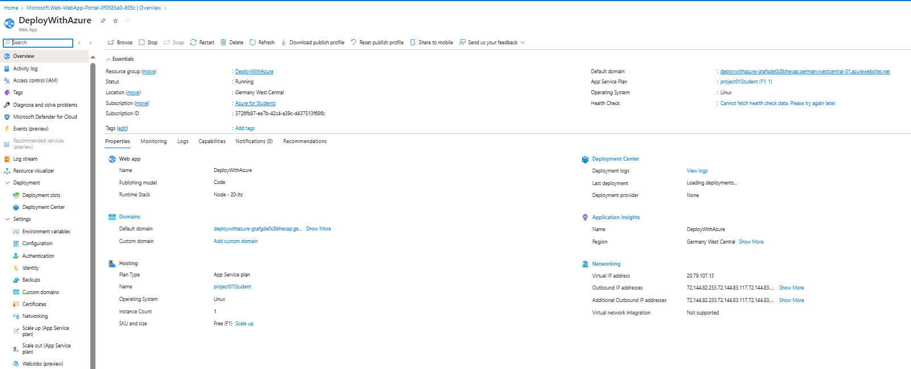

---  

## Azure DevOps Setup

Azure DevOps is a suite of tools and services designed to streamline software development. It offers tools for project planning, source control, build automation, and release management.

### 1. Access Azure DevOps

- Go to [Azure DevOps](https://dev.azure.com/).
- Log in or click **Start free** if you don't have an account.
- After logging in, you'll see the Azure DevOps dashboard.


### 2. Create a New Project

- Click **New Project**.
- Enter a project **name**, optional **description**, and set **visibility** (public/private).
- Click **Create** to set up your project.

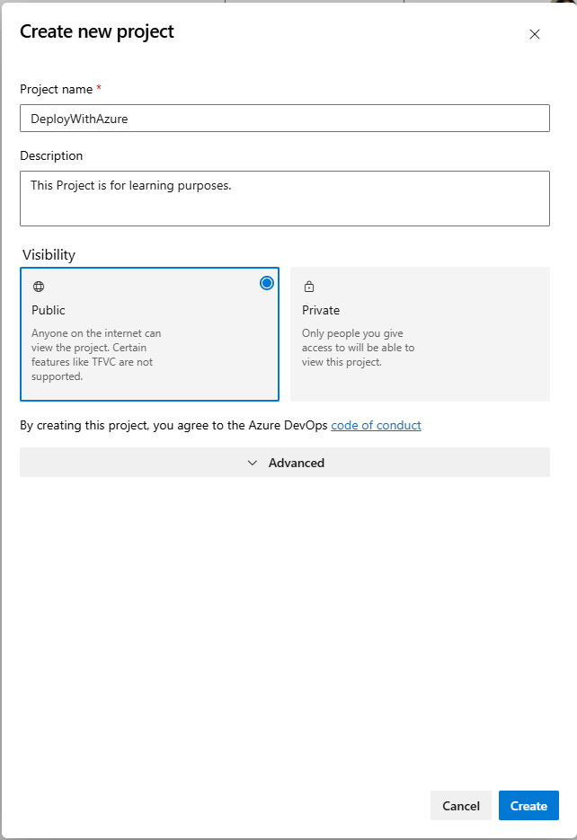

### 3. Azure DevOps Project Overview

After creating your project, you'll see an overview page with access to various services:

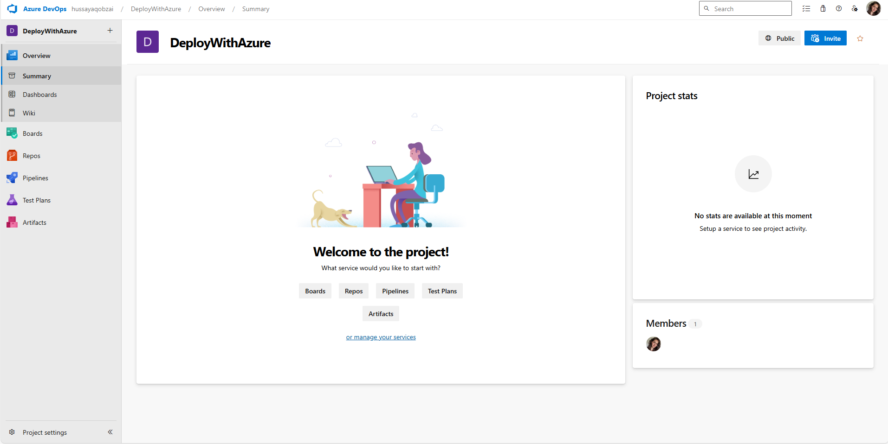

### 4. Key Azure DevOps Services

Here's a brief overview of Azure DevOps services you'll commonly use:

- **Boards**: Manage tasks, track progress, create user stories, bugs, and manage sprints using Kanban boards.
- **Repos**: Host Git repositories, manage branches, pull requests, and track commit history.
- **Pipelines**: Automate builds, testing, and deployment of applications through CI/CD pipelines.
- **Test Plans**: Organize test cases, suites, and plans; perform manual and automated testing.
- **Artifacts**: Manage and share build artifacts like NuGet, Maven, or npm packages.
- **Project Settings**: Configure general settings, manage team members, permissions, security, and service connections.

---


## Azure Devops CI/CD Pipeline Setup
Follow these steps to set up a CI/CD pipeline in Azure DevOps:

### 1. Create a New Pipeline

- Log in to [Azure DevOps](https://dev.azure.com/) and open your project.
- Navigate to **Pipelines** > click **Create Pipeline**.

#### Step 1: Connect Repository

- Select **GitHub** (or your chosen source control provider like Azure Repos, Bitbucket).
- Authorize Azure Pipelines to access your GitHub account when prompted.

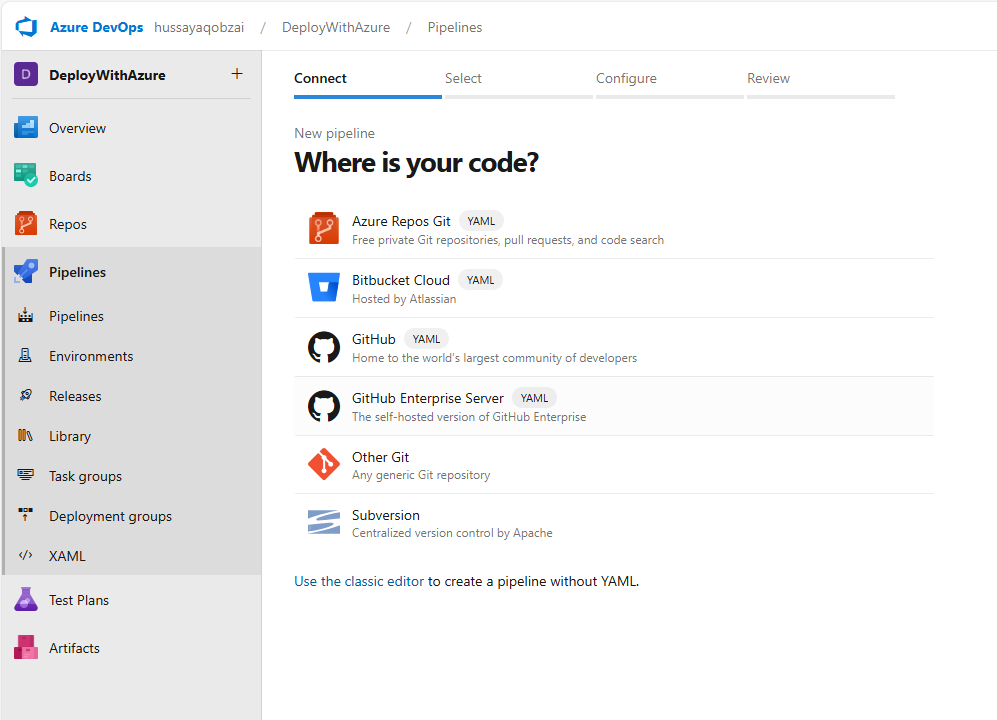

#### Step 2: Select Repository

- Choose the repository containing your project.
- Search or select directly from the displayed list.

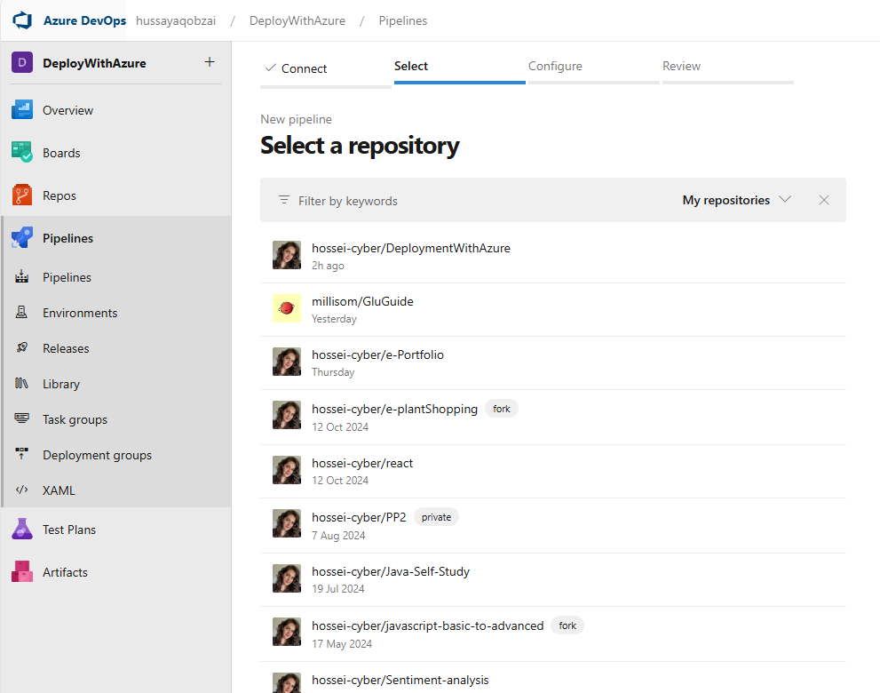

#### Step 3: Configure Pipeline

- Select the pipeline template. For Node.js projects, choose **Node.js**.
- Alternatively, select **Empty job** if you prefer customizing from scratch.

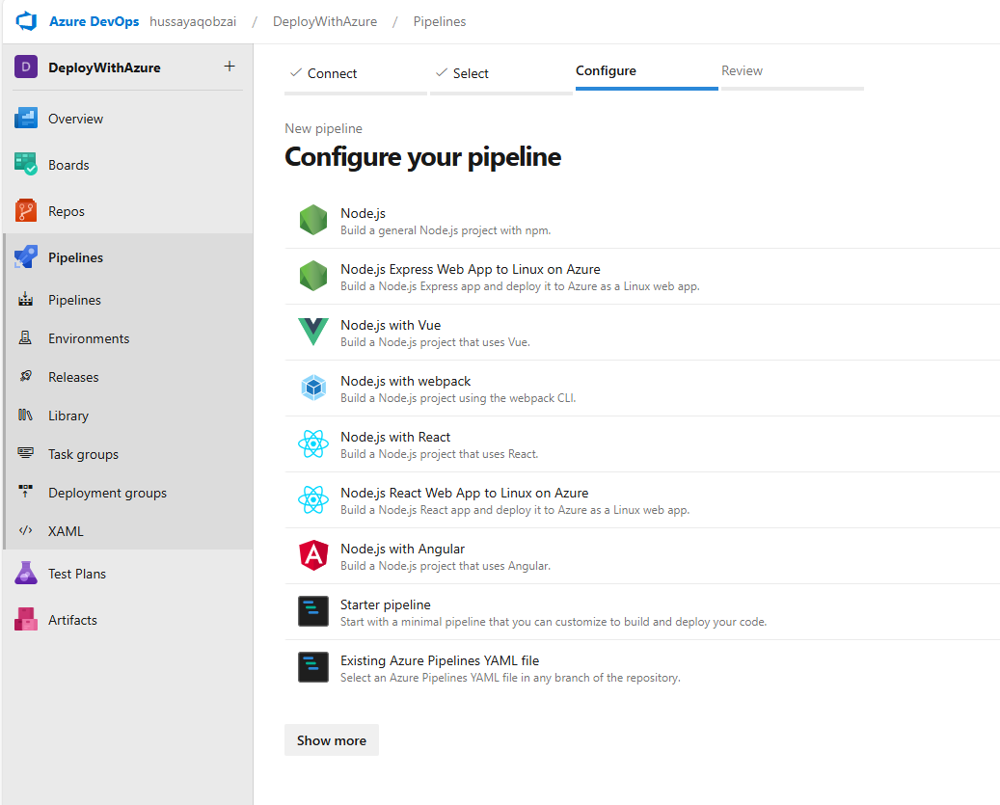

#### Step 4: Review and Edit YAML

- Review your pipeline's YAML configuration. Customize if necessary. we will see the following YAML file:
```yaml
trigger:
- main

stages:
- stage: Build
  displayName: 'Build Stage'
  jobs:
  - job: BuildJob
    displayName: 'Build Job'
    pool:
      vmImage: 'ubuntu-latest'
    steps:
    - task: NodeTool@0
      inputs:
        versionSpec: '20.x'
      displayName: 'Install Node.js'

    - script: |
        cd server
        npm install
      displayName: 'Install Dependencies'

    - task: ArchiveFiles@2
      inputs:
        rootFolderOrFile: '$(System.DefaultWorkingDirectory)'
        includeRootFolder: false
        archiveType: 'zip'
        archiveFile: '$(Build.ArtifactStagingDirectory)/backend.zip'
        replaceExistingArchive: true
      displayName: 'Archive Backend Files'

    - publish: '$(Build.ArtifactStagingDirectory)/backend.zip'
      artifact: 'drop'

- stage: Deploy
  displayName: 'Deploy Stage'
  dependsOn: Build
  jobs:
  - deployment: DeployJob
    displayName: 'Deploy Job'
    environment: 'production'
    pool:
      vmImage: 'ubuntu-latest'
    strategy:
      runOnce:
        deploy:
          steps:
          - download: current
            artifact: drop

          - task: AzureRmWebAppDeployment@5
            inputs:
              ConnectionType: 'AzureRM'
              azureSubscription: 'Azure for Students(3726fb87-ee7b-42c4-a39c-d437513f686c)'
              appType: 'webAppLinux'
              WebAppName: 'project02Student'
              packageForLinux: '$(Pipeline.Workspace)/drop/backend.zip'
              DeploymentTypeLinux: 'zipDeploy'
              StartupCommand: 'cd server && npm start'
```
### 2. Run the Pipeline

- After reviewing and saving your pipeline, click **Run**.
- Monitor the pipeline stages (**Build** and **Deploy**) within Azure DevOps.

- **Check the pipeline logs:**  
  You can view the logs and status of each pipeline step. A successful build stage will look like this:

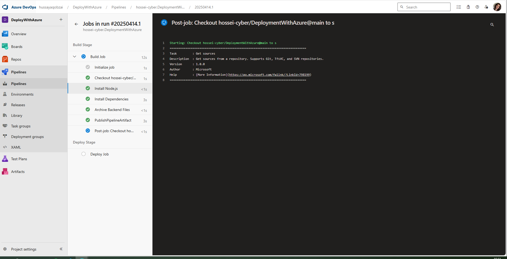

- **Authorize deployment:**  
  During the deployment stage, Azure DevOps may request permission. Click **Permit** to authorize the deployment:

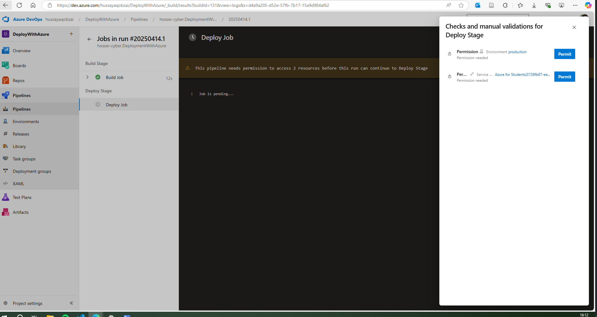

- **Successful deployment:**  
  Once completed successfully, the pipeline will show green checkmarks for all stages:

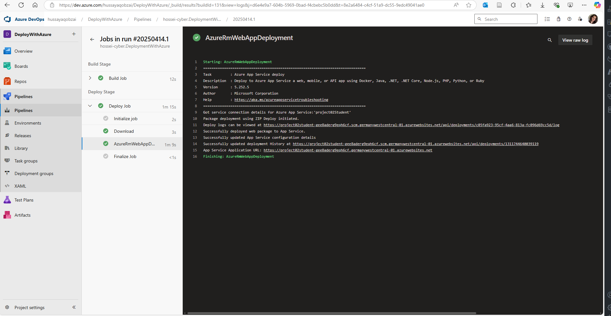

---

### 3. Verify Deployment in Azure Portal

- Go to **App Services** in the [Azure Portal](https://portal.azure.com/).
- Select your deployed web app.
- Check the **Deployment Center** to review the deployment status, history, and logs.
- View your app’s status under the **Overview** section.
- Confirm your application is running correctly by opening the provided URL.

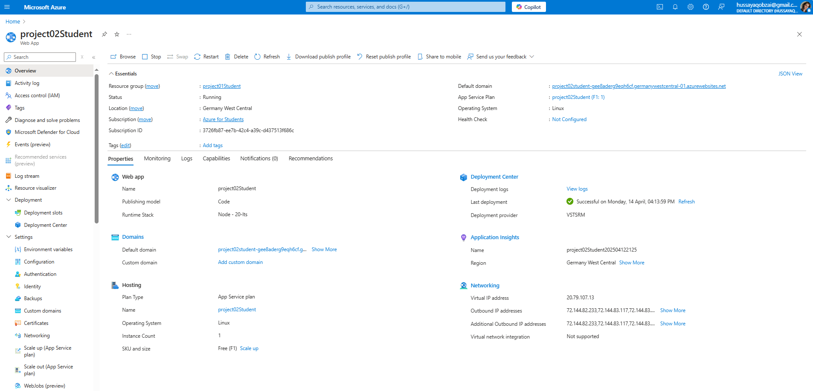

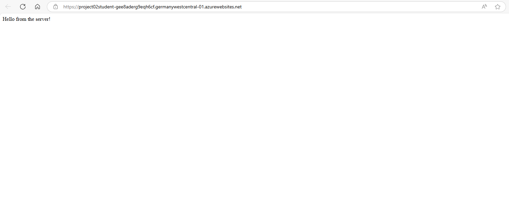


---  

## YAML File Explained

The YAML file configures your CI/CD pipeline. It is structured into two primary sections: `trigger` and `stages`.

### Trigger Section

Defines conditions for pipeline execution. Here, the pipeline runs on every commit to the `main` branch:

```yaml
trigger:
- main
```
### Stages Section

Our pipeline is divided into two main stages:
### 1. Build Stage

This stage is responsible for preparing the application for deployment. It includes:

- **Installing Node.js:** Ensures the required Node.js runtime is available.
- **Installing dependencies:** Uses npm to install required server-side libraries and dependencies.
- **Archiving backend files:** Packages the application files into a zip archive.
- **Publishing artifacts:** Publishes the zipped backend files (`drop`) so they can be accessed in the subsequent deployment stage.
```yaml
stages:                                                                                   # Define the stages in the pipeline
- stage: Build                                                                            # Define the Build stage                            
  displayName: 'Build Stage'                                                              # Display name for the Build stage                            
  jobs:                                                                                   # Define the jobs in the Build stage                       
  - job: BuildJob                                                                         # Define the Build job                   
    displayName: 'Build Job'                                                          	  # Display name for the Build job                        
    pool:                                                                                 # Define the pool for the Build job
      vmImage: 'ubuntu-latest'                                                            # Use the latest Ubuntu image for the Build job                   
    steps:                                                                                # Define the steps in the Build job                  
    - task: NodeTool@0                                                                    # Use the NodeTool task to install Node.js            
      inputs:                                                                             # Define the inputs for the NodeTool task
        versionSpec: '20.x'                                                               # Specify the version of Node.js to install                
      displayName: 'Install Node.js'                                                      # Display name for the NodeTool task for readability   
    - script: |                                                                           # Define a script to run multiple commands for the Build job            
        cd server
        npm install
      displayName: 'Install Dependencies'                                                 # Display name for the script step for readability             

    - task: ArchiveFiles@2                                                                # Use the ArchiveFiles task to create a zip file of the backend files for deployment
      inputs:                                                                             # Define the inputs for the ArchiveFiles task
        rootFolderOrFile: '$(System.DefaultWorkingDirectory)'                             # Specify the root folder or file to archive in this case the current working directory where the pipeline is running
        includeRootFolder: false                                                          # Exclude the root folder from the archive  
        archiveType: 'zip'                                                                # Specify the archive type as zip       
        archiveFile: '$(Build.ArtifactStagingDirectory)/backend.zip'                      # Specify the path for the archive file to be created in the artifact staging directory which means the directory where the artifacts are stored before being published
        replaceExistingArchive: true                                                      # Replace the existing archive file if it already exists in the artifact staging directory
      displayName: 'Archive Backend Files'                                                # Display name for the ArchiveFiles task for readability
    - publish: '$(Build.ArtifactStagingDirectory)/backend.zip'                            # Publish the archive file as an artifact for the next stage to use
      artifact: 'drop'                                                                    # Specify the name of the artifact to be published
``` 

### 2. Deploy Stage

This stage handles deploying your application to Azure App Service. It includes:

- **Downloading artifacts:** Retrieves the archived files produced in the build stage.
- **Deploying to Azure App Service:** Uploads and deploys the application archive to Azure, specifying key deployment settings.

```yaml
- stage: Deploy                                                                             # Define the Deploy stage
  displayName: 'Deploy Stage'                                                               # Display name for the Deploy stage
  dependsOn: Build                                                                          # Specify that the Deploy stage depends on the Build stage because the Deploy stage should only run after the Build stage is completed successfully
  jobs:                                                                                     # Define the jobs in the Deploy stage
  - deployment: DeployJob                                                                   # Define the Deploy job
    displayName: 'Deploy Job'                                                               # Display name for the Deploy job
    environment: 'production'                                                               # Specify the environment for the Deploy job. In our case, we are deploying to the production environment
    pool:                                                                                   # Define the pool for the Deploy job
      vmImage: 'ubuntu-latest'                                                              # Use the latest Ubuntu image for the Deploy job
    strategy:                                                                               # Define the strategy for the Deploy job
      runOnce:                                                                              # Specify that the Deploy job should run once
        deploy:                                                                             # Define the deployment steps for the Deploy job
          steps:                                                                            # Define the steps in the Deploy job
          - download: current                                                               # Download the artifacts from the current pipeline run
            artifact: drop                                                                  # Specify the name of the artifact to download which is the zip file created in the Build stage
          - task: AzureRmWebAppDeployment@5                                                 # Use the AzureRmWebAppDeployment task to deploy the web app to Azure
            inputs:                                                                         # Define the inputs for the AzureRmWebAppDeployment task
              ConnectionType: 'AzureRM'                                                     # Specify the connection type as Azure Resource Manager (AzureRM)
              azureSubscription: 'Azure for Students(3726fb87-ee7b-42c4-a39c-d437513f686c)' # Specify the Azure subscription to use for the deployment.
              appType: 'webAppLinux'                                                        # Specify the type of app to deploy as a Linux web app
              WebAppName: 'project02Student'                                                # Specify the name of the web app to deploy to
              packageForLinux: '$(Pipeline.Workspace)/drop/backend.zip'                     # Specify the path to the zip file to deploy to the web app
              DeploymentTypeLinux: 'zipDeploy'                                              # Specify the deployment type as zip deployment for Linux web apps
              StartupCommand: 'cd server && npm start'                                      # Specify the startup command to run after deployment. In our case, we are changing to the server directory and starting the server using npm
```
### Key YAML Inputs Explained:

- **`ConnectionType`:** Defines the method of connecting to Azure, typically set to `AzureRM`.
- **`azureSubscription`:** Specifies your Azure subscription name or ID. *(Replace placeholders with your actual details.)*
- **`appType`:** Indicates the deployment type (e.g., `webAppLinux`).
- **`WebAppName`:** The name of your Azure web application. *(Replace placeholders with your actual web app name.)*
- **`packageForLinux`:** Path to the zipped application artifact for deployment.
- **`DeploymentTypeLinux`:** Specifies deployment method (`zipDeploy` for Linux apps).
- **`StartupCommand`:** Command executed after successful deployment, typically to start the application.

### Additional Information:

- **Environment Configuration:** The deployment stage uses environments like `production` to manage deployments safely and efficiently. You can define additional environments (e.g., staging, testing) within Azure DevOps to suit different deployment workflows.

For more detailed guidance on Azure DevOps pipeline environments, refer to the [official Azure DevOps documentation](https://learn.microsoft.com/azure/devops/pipelines/process/environments).

---  

## Monitoring the Pipeline

You can monitor your application's logs and deployment status directly from your terminal using the Azure CLI, or through the Azure Portal.

### Using Azure CLI

To view detailed, real-time logs for your Azure Web App via the command line, follow these steps:

**1. Login to Azure CLI:**

```bash
az login
```
**2. List Azure Subscriptions:**
To view all your subscriptions, use the following command:

```bash
az account list --output table
```
**3. Set the Subscription Context:**
To set the context to your desired subscription, use:

```bash

az account set --subscription "Your Subscription Name or ID"
```
Replace `Your Subscription Name or ID` with the actual name or ID of your subscription.

**4. List Resource Groups:**
To see all your resource groups, run:

```bash
az group list --output table
```

**5. List Web Apps:**
To see all your web apps, run:

```bash
az webapp list --output table
```
**6. View Logs:**
To view logs for a specific web app, use the following command, replacing `your-resource-group` and `your-web-app-name` with your actual resource group and web app name:

```bash
az webapp log tail --name your-web-app-name --resource-group your-resource-group
```
This command will stream the logs in real-time, allowing you to monitor your application as it runs.

---


## Troubleshooting

If you encounter issues during deployment or while running your application, here are some common problems and suggested solutions:

| Issue                         | Possible Cause                               | Solution                                                                                     |
|-------------------------------|----------------------------------------------|----------------------------------------------------------------------------------------------|
| Pipeline fails to deploy      | Incorrect Azure permissions or credentials   | Check your Azure Service Connection in Azure DevOps and ensure correct permissions are set.  |
| Application crashes at startup| Misconfigured environment variables or scripts| Verify your `StartupCommand` in YAML and ensure correct configuration of environment variables in Azure Portal under the App Service settings. |
| Database connection issues    | Incorrect database URL (`DATABASE_URL`)      | Double-check your database connection string, ensure credentials, host, port, and database name are accurate. |
| Static Web App returns a 404  | Incorrect build output path                  | Confirm your React app's build path (`client/build`) matches Azure Static Web App configuration. |
| GitHub Actions fails          | Misconfigured GitHub workflow file            | Review the workflow logs under `.github/workflows` and ensure your build and deploy steps are correctly defined. |

---

## Further Resources

For additional guidance and in-depth knowledge, refer to the following resources:

- [Azure App Service Documentation](https://learn.microsoft.com/azure/app-service/)
- [Azure Static Web Apps Documentation](https://learn.microsoft.com/azure/static-web-apps/)
- [Azure DevOps Pipelines Guide](https://learn.microsoft.com/azure/devops/pipelines/)
- [Managing Azure Secrets and Secure Configuration](https://learn.microsoft.com/azure/app-service/app-service-key-vault-references)
- [Azure Security Best Practices](https://learn.microsoft.com/azure/security/)
- [Node.js Deployment Best Practices](https://learn.microsoft.com/azure/app-service/configure-language-nodejs?pivots=platform-linux)
- [CI/CD with GitHub Actions](https://docs.github.com/actions)

---  


## Conclusion
This tutorial has shown you how to set up a simple web application with React, Express, Node.js, and PostgreSQL, and deploy it to Azure using Azure Static Web Apps and Azure App Service. You have learned how to create a CI/CD pipeline in Azure DevOps to automate the build and deployment process. You have also learned how to use YAML to define the pipeline and configure the different stages, jobs, and steps in the pipeline. You can now use this knowledge to deploy your own web applications to Azure and automate the deployment process using Azure DevOps.
You can also customize the pipeline to fit your project requirements and add more stages, jobs, and steps as needed. If you have any questions or feedback, feel free to reach out to me. I hope you found this tutorial helpful and informative. Happy coding!


